# 08 — Sigma Rules

## Overview

With four Wazuh detections built, validated, and documented in `07-detection-engineering.md`, this phase translates those same detections into [Sigma](https://github.com/SigmaHQ/sigma) — a vendor-neutral detection rule format. The goal is not to duplicate the Wazuh rules, but to express the same underlying detection logic in a way that is understandable and portable independently of Wazuh's specific rule syntax.

Each Sigma rule was written, schema-checked, converted into a real search query against Wazuh's actual backend (OpenSearch), and validated against live telemetry already confirmed in Phase 07. This phase surfaced several genuine, non-obvious findings about how Sigma's tooling and Wazuh's data storage interact — these are documented in detail, since understanding *why* a converted query does or doesn't match real data is the core skill this phase is meant to build.

---

## 1. Why Sigma

A Wazuh rule (`local_rules.xml`) is tied to Wazuh's specific XML schema, field-naming conventions, and rule engine behavior. It cannot be directly reused by a different SIEM, shared with another team running a different platform, or published as a general-purpose detection without rewriting it entirely.

Sigma addresses this by separating **detection logic** from **backend implementation**. A Sigma rule describes *what* behavior to detect — using generic field names and simple match conditions — without specifying *how* a particular SIEM should query for it. A separate conversion step (`sigma convert`) translates the generic rule into a real query for a specific backend (Elasticsearch/OpenSearch Lucene, Splunk SPL, etc.).

This phase treats Sigma accordingly: not as "another way to write a Wazuh rule," but as an independent description of detection logic that happens to be validated *against* Wazuh's backend in this lab, the same logic could in principle be converted against a different backend entirely.

---

## 2. Detection Engineering → Sigma Workflow

```text
Wazuh Detection (validated in Phase 07)
       ↓
Express the same behavior generically
       ↓
Write Sigma rule (YAML)
       ↓
sigma check — schema/tag validation
       ↓
sigma convert — translate to a backend query (Lucene)
       ↓
Correct field names / syntax for the actual backend
       ↓
Run corrected query against real data (Wazuh/OpenSearch)
       ↓
Confirm it retrieves the same alert already validated in Phase 07
```

Each of the four Sigma rules below went through every step of this cycle. In every case, the raw converted query required correction before it worked — this is expected and is documented as part of the process, not treated as a failure of the tool.

---

## 3. Sigma Rule Structure

A Sigma rule consists of:

* `logsource` — describes the category of telemetry the rule applies to (e.g. `process_creation`, or a specific `product`/`service` combination)
* `detection` — one or more named selection blocks, each listing field-match conditions, combined by a `condition` expression
* `tags` — MITRE ATT&CK technique IDs (and, in some cases, tactic names)
* `falsepositives` — known benign causes of a match
* `level` — a severity rating, conceptually similar to a Wazuh rule's `level` attribute

The `logsource` field matters more than it first appears: it determines which **pipeline** (field-mapping convention) a conversion tool applies. This phase's rules use two different `logsource` types — `process_creation` (Rules 01–03) and `product: windows, service: security` (Rule 04) — and, as Section 8 details, this caused the conversion tool to map fields using two genuinely different naming conventions.

---

## 4. Rule 01 — PowerShell Process Execution

```yaml
title: PowerShell Process Execution
id: 67f961c2-f7b6-408b-a768-9b143bd73aa0
status: experimental
description: Detects execution of powershell.exe or pwsh.exe via process creation
references:
    - internal://detection-engineering
author: R S Sacheth
date: 2026/09/11
tags:
    - attack.execution
    - attack.t1059.001
logsource:
    category: process_creation
    product: windows
detection:
    selection:
        Image|endswith:
            - '\powershell.exe'
            - '\pwsh.exe'
    condition: selection
falsepositives:
    - Legitimate PowerShell administration
    - System administration scripts
level: low
```

**Sigma file:** `sigma/powershell-process-execution.yml`
**Corresponds to:** Wazuh rule `100002` (see `07-detection-engineering.md`, Detection 01).

### Schema check

```bash
sigma check powershell-process-execution.yml
```
Passed cleanly — no errors, no issues.

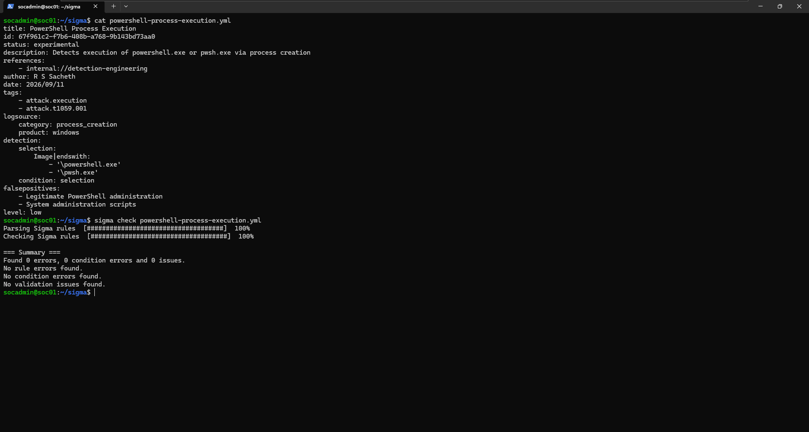

### Conversion

```bash
sigma convert -t lucene -p ecs_windows powershell-process-execution.yml
```
Output:
```
process.executable.caseless:(*\\powershell.exe OR *\\pwsh.exe)
```

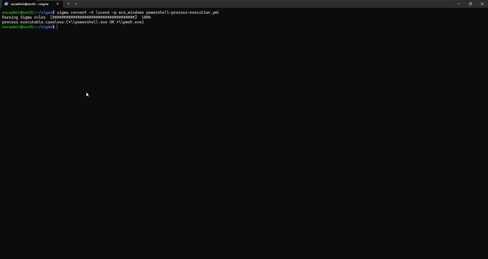

The `ecs_windows` pipeline mapped `Image` to `process.executable.caseless` — Elastic Common Schema's field name for a running process's executable path. This is **not** the field name Wazuh actually uses for the same data.

### Correction and validation

Wazuh stores this field as `data.win.eventdata.image`. The corrected query:

```
data.win.eventdata.image:(*\\powershell.exe OR *\\pwsh.exe)
```

was run in Discover against the `wazuh-alerts-*` index and returned 12 hits, correctly matching rule `100002` alerts (MITRE `T1059.001`) generated across earlier testing sessions.

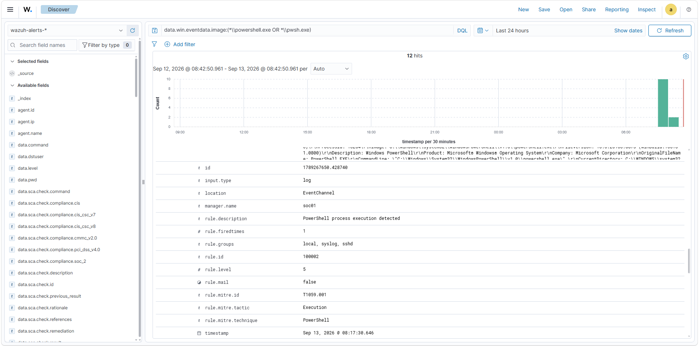

**Finding:** this query parsed correctly under Wazuh's default DQL search mode without needing to switch to Lucene mode — its syntax (a simple double-backslash-escaped wildcard) happens to be valid under both languages. This was not true for Rule 02, below.

---

## 5. Rule 02 — Encoded PowerShell from a Non-PowerShell Parent

```yaml
title: Encoded PowerShell Command from Non-PowerShell Parent
id: c731f4f0-10a2-4de6-905f-50be37049071
status: experimental
description: Detects PowerShell executed with an encoded/Base64 command where the parent process is not PowerShell itself
references:
    - internal://detection-engineering
author: R S Sacheth
date: 2026/09/11
tags:
    - attack.execution
    - attack.t1059.001
    - attack.t1027
logsource:
    category: process_creation
    product: windows
detection:
    selection_image:
        Image|endswith:
            - '\powershell.exe'
            - '\pwsh.exe'
    selection_encoded:
        CommandLine|contains:
            - '-e '
            - '-enc '
            - '-encodedcommand'
    filter_parent_powershell:
        ParentImage|endswith:
            - '\powershell.exe'
            - '\pwsh.exe'
    condition: selection_image and selection_encoded and not filter_parent_powershell
falsepositives:
    - Configuration management tools passing arguments via encoding
    - Scheduled automation using -EncodedCommand for complex payloads
level: high
```

**Sigma file:** `sigma/encoded-powershell-non-ps-parent.yml`
**Corresponds to:** Wazuh rule `100004` (see `07-detection-engineering.md`, Detection 02).

### Schema check — tag issue found and fixed

The first `sigma check` run flagged an issue:

```text
issue=InvalidATTACKTagIssue severity=medium description=Invalid MITRE ATT&CK tagging
tag=attack.defense_evasion
```

`attack.defense_evasion` was included as a standalone tactic tag alongside `attack.t1027`, whose tactic *is* Defense Evasion — the checker flags this as redundant. Removing the bare tactic tag and keeping only technique-level tags (`attack.execution`, `attack.t1059.001`, `attack.t1027`) resolved the issue. A re-run returned a clean result:

```bash
sigma check encoded-powershell-non-ps-parent.yml
```
```
Found 0 errors, 0 condition errors and 0 issues.
```

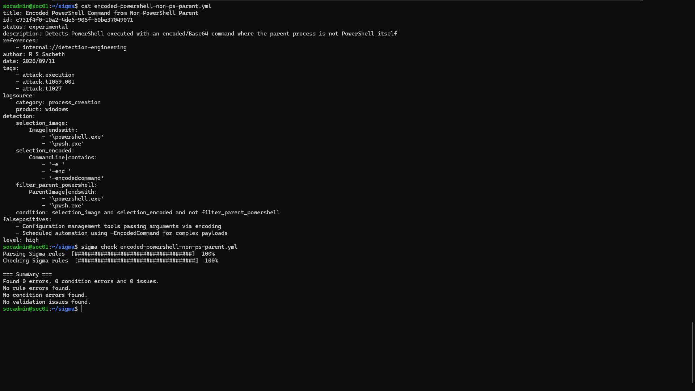

### Conversion

```bash
sigma convert -t lucene -p ecs_windows encoded-powershell-non-ps-parent.yml
```
Output:
```
(process.executable.caseless:(*\\powershell.exe OR *\\pwsh.exe)) AND (process.command_line:(*\-e\ * OR *\-enc\ * OR *\-encodedcommand*)) AND (NOT (process.parent.executable.caseless:(*\\powershell.exe OR *\\pwsh.exe)))
```

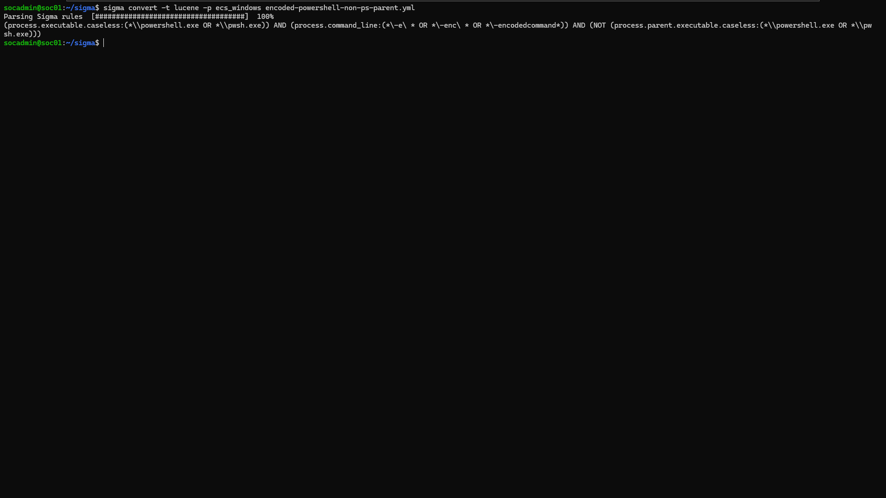

The three named Sigma conditions (`selection_image`, `selection_encoded`, `filter_parent_powershell`) and the `and not` logic translated correctly into three ANDed clauses with a `NOT` wrapping the parent-process exclusion — confirming Sigma's boolean condition logic compiles predictably even for a multi-clause rule.

### Correction and validation — two independent issues found

**Issue 1 — field naming**, same as Rule 01: `process.executable.caseless`, `process.command_line`, and `process.parent.executable.caseless` were replaced with `data.win.eventdata.image`, `data.win.eventdata.commandLine`, and `data.win.eventdata.parentImage`.

**Issue 2 — hyphen stripping.** With only the field names corrected, the query still returned no results, despite the target event being confirmed present in `archives.json`. This was isolated through a sequence of progressively narrower test queries:

| Query | Result |
|---|---|
| `data.win.eventdata.commandLine:*powershell*` | Matched |
| `data.win.eventdata.commandLine:*EncodedCommand*` | Matched |
| `data.win.eventdata.commandLine:*-encodedcommand*` (hyphen retained) | No match |
| `data.win.eventdata.image:(*\\powershell.exe OR *\\pwsh.exe)` (backslash retained) | Matched |

This confirmed the specific cause: OpenSearch's default text analyzer strips **hyphens** from indexed terms during tokenization (`-EncodedCommand` is indexed as `encodedcommand`), but **does not** strip backslashes from the same field. The two characters were isolated and tested independently rather than assumed to behave the same way.

**Final validated query:**
```
(data.win.eventdata.image:(*\\powershell.exe OR *\\pwsh.exe)) AND (data.win.eventdata.commandLine:*EncodedCommand*) AND (NOT (data.win.eventdata.parentImage:(*\\powershell.exe OR *\\pwsh.exe)))
```

Run in Discover with the query-language toggle set to **Lucene** (the original hyphen-escaped query also failed under DQL parsing, independent of the tokenization issue — DQL's parser does not accept Lucene-style character escaping such as `\-`). This returned the `100004` alert generated by a fresh `cmd.exe → powershell.exe -EncodedCommand` test, matching the scenario already validated in Phase 07, Section 6.5.

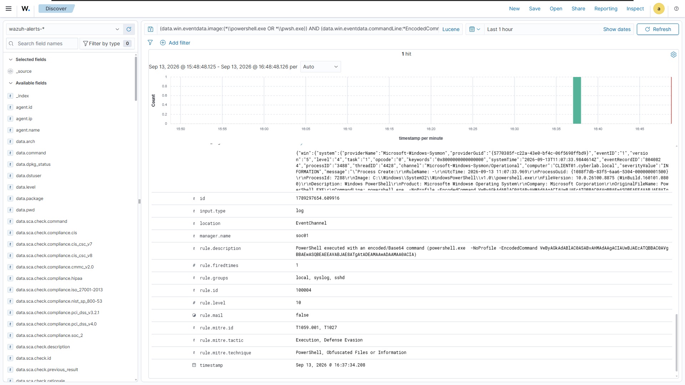

---

## 6. Rule 03 — cmd.exe Spawned Directly by PowerShell

```yaml
title: cmd.exe Spawned Directly by PowerShell
id: 7e22801c-bf87-49c0-8502-c503a2dda24a
status: experimental
description: Detects cmd.exe launched directly by powershell.exe or pwsh.exe
references:
    - internal://detection-engineering
author: R S Sacheth
date: 2026/09/11
tags:
    - attack.execution
    - attack.t1059.003
logsource:
    category: process_creation
    product: windows
detection:
    selection:
        Image|endswith: '\cmd.exe'
        ParentImage|endswith:
            - '\powershell.exe'
            - '\pwsh.exe'
    condition: selection
falsepositives:
    - Legitimate scripts that shell out to cmd.exe for batch-file compatibility
    - Administrative automation
level: medium
```

**Sigma file:** `sigma/cmd-spawned-by-powershell.yml`
**Corresponds to:** Wazuh rule `100003` (see `07-detection-engineering.md`, Detection 03).

### Schema check

```bash
sigma check cmd-spawned-by-powershell.yml
```
Passed cleanly on the first run — no tag issues, no errors.

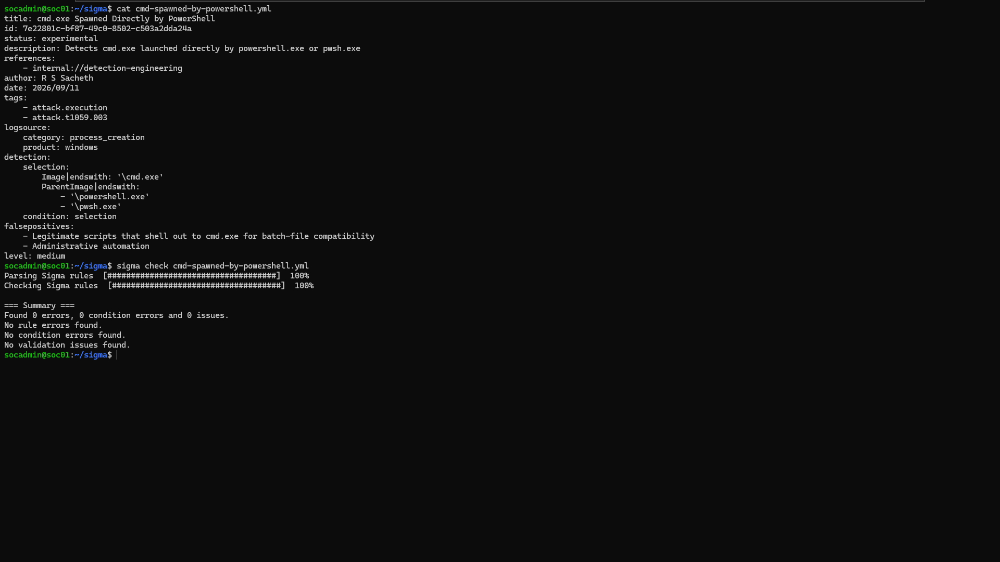

**Note:** this rule includes the bare tactic tag `attack.execution` alongside `attack.t1059.003`, the same pairing style flagged as redundant in Rule 02 (there, `attack.defense_evasion` alongside `attack.t1027`) and later in Rule 04 (`attack.credential_access` alongside `attack.t1110`). It was not flagged here. This suggests `sigma check`'s redundancy rule applies to specific tactic/technique pairings rather than rejecting all bare tactic tags uniformly — Execution does not appear to be treated as redundant in the same way Defense Evasion and Credential Access were.

### Conversion

```bash
sigma convert -t lucene -p ecs_windows cmd-spawned-by-powershell.yml
```
Output:
```
process.executable.caseless:*\\cmd.exe AND (process.parent.executable.caseless:(*\\powershell.exe OR *\\pwsh.exe))
```

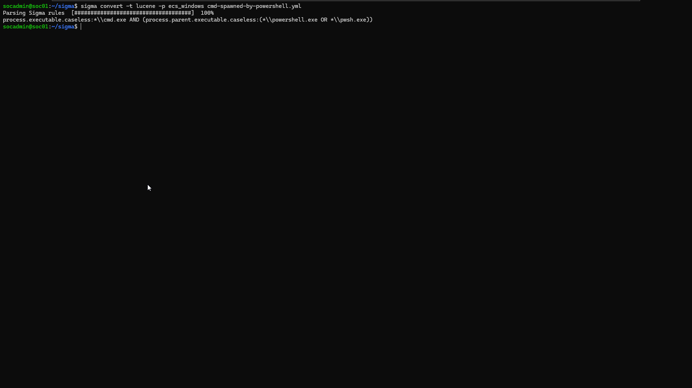

### Correction and validation

Field names corrected to Wazuh's convention. Since this rule contains no hyphens, only the field-naming correction (already confirmed necessary and sufficient in Rule 01) was required:

```
data.win.eventdata.image:*\\cmd.exe AND (data.win.eventdata.parentImage:(*\\powershell.exe OR *\\pwsh.exe))
```

Run against a freshly generated `powershell.exe -Command "cmd.exe /c echo ..."` event, this returned the corresponding `100003` alert.

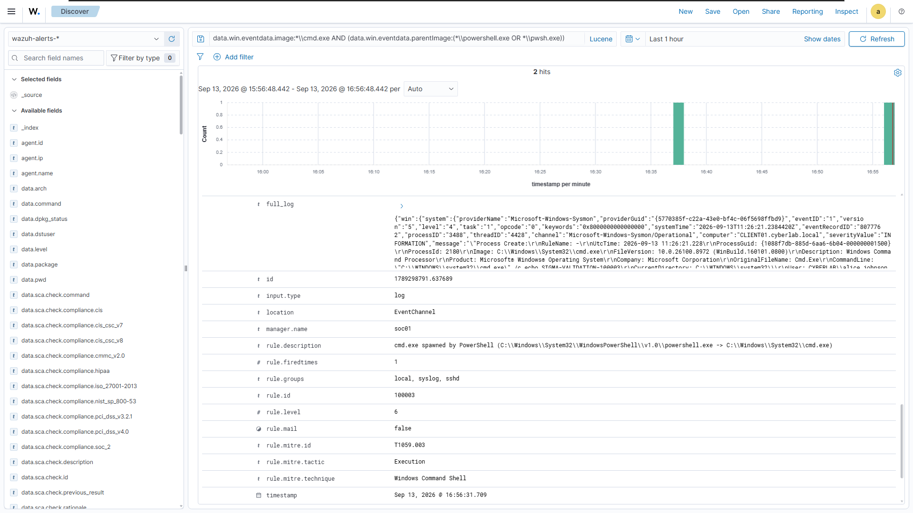

---

## 7. Rule 04 — Failed Interactive Logon

```yaml
title: Failed Interactive Logon
id: be319fa2-79d2-4a04-a03d-eb3505c06387
status: experimental
description: Detects a failed interactive logon attempt (Event ID 4625, Logon Type 2)
references:
    - internal://detection-engineering
author: R S Sacheth
date: 2026/09/11
tags:
    - attack.t1110
logsource:
    product: windows
    service: security
detection:
    selection:
        EventID: 4625
        LogonType: 2
    condition: selection
falsepositives:
    - Users mistyping passwords
    - Forgotten credentials
    - Normal authentication errors
level: low
```

**Sigma file:** `sigma/failed-interactive-logon.yml`
**Corresponds to:** Wazuh rule `100005` (see `07-detection-engineering.md`, Detection 04).

### Schema check — tag issue found and fixed

Same redundancy pattern as Rule 02: the first run flagged `attack.credential_access` as invalid, since `attack.t1110`'s tactic already **is** Credential Access.

```text
issue=InvalidATTACKTagIssue severity=medium description=Invalid MITRE ATT&CK tagging
tag=attack.credential_access
```

Removed, keeping only `attack.t1110`. Re-run passed cleanly.

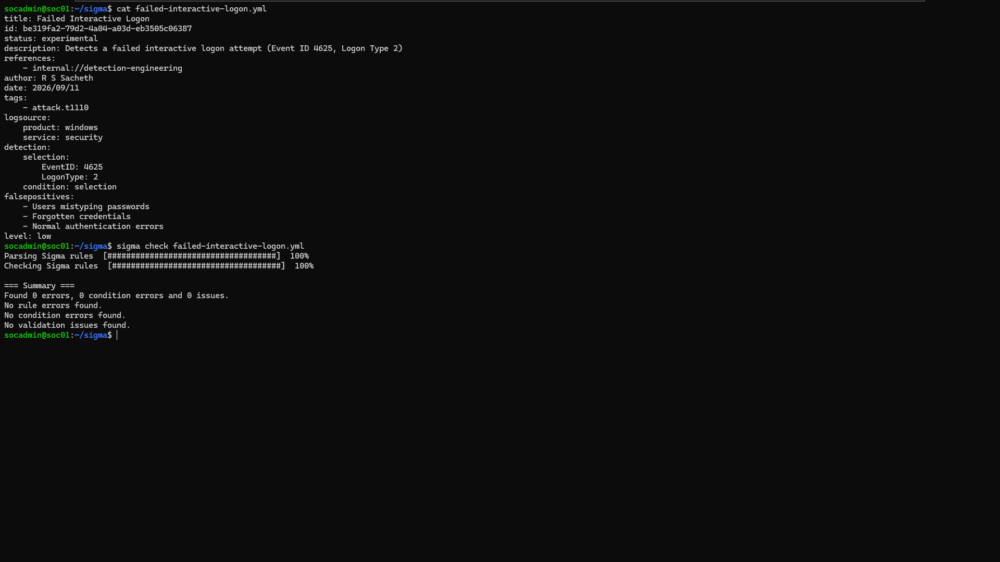

### Conversion — a different field-mapping convention entirely

```bash
sigma convert -t lucene -p ecs_windows failed-interactive-logon.yml
```
Output:
```
winlog.channel:Security AND (event.code:4625 AND winlog.event_data.LogonType:2)
```

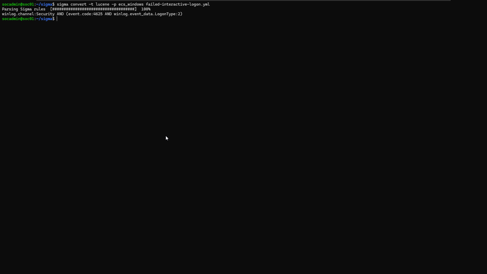

This is a structurally different result from Rules 01–03. Those rules used `logsource: category: process_creation`, and the `ecs_windows` pipeline mapped their fields into the `process.*` namespace (Elastic's convention for process telemetry, as ingested from Sysmon). Rule 04 uses `logsource: product: windows, service: security` — a Windows Security Event rather than a process-creation event — and the same pipeline mapped its fields into an entirely different namespace: `winlog.*` and `event.*` (Elastic's convention for raw Windows Event Log entries, as ingested by Winlogbeat).

This confirms the `ecs_windows` pipeline is not a single flat field-renaming table. It branches internally based on the declared `logsource`, applying the ECS convention appropriate to that specific log source type.

### Correction and validation

Wazuh's actual fields for this event, established in Phase 07 (Detection 04), are `win.system.channel`, `win.system.eventID`, and `win.eventdata.logonType`. Corrected query:

```
data.win.system.channel:Security AND (data.win.system.eventID:4625 AND data.win.eventdata.logonType:2)
```

Run against the existing `100005` alert (Windows Security Event 4625, Logon Type 2, `CYBERLAB\alice.johnson`) already validated in Phase 07, this query returned the matching alert.

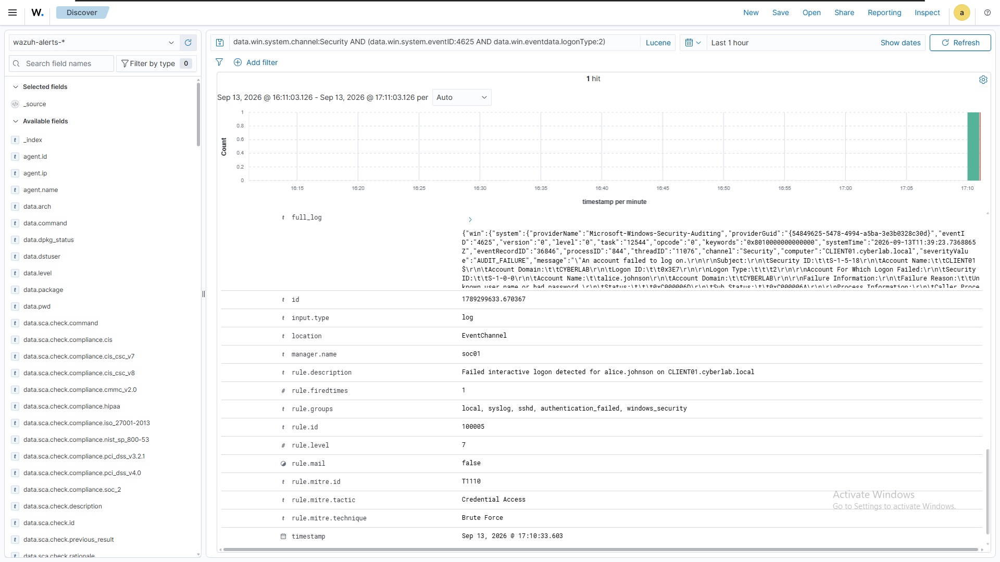

---

## 8. Sigma Validation — Summary of Findings

Every rule in this phase required at least one correction between the raw `sigma convert` output and a query that actually matched real data. The corrections fall into three distinct categories:

| Finding | Rules affected | Cause |
|---|---|---|
| Field naming (ECS vs. Wazuh) | All four | The `ecs_windows` pipeline maps to Elastic Common Schema field names; Wazuh indexes the same underlying Sysmon/Windows data under its own `win.*`/`data.win.*` naming convention. No dedicated Wazuh pipeline exists in the standard pySigma plugin set. |
| Hyphen stripping during tokenization | Rule 02 only | OpenSearch's default text analyzer removes hyphens from indexed terms in analyzed `text` fields. Wildcard patterns containing an escaped hyphen (`\-encodedcommand`) cannot match the resulting token (`encodedcommand`). Backslash characters in the same field are preserved and matched correctly — confirmed by isolating each character independently rather than assuming both behaved the same way. |
| Pipeline branching by logsource | Rule 04 only | The same `ecs_windows` pipeline produces different field-naming conventions (`process.*` vs. `winlog.*`/`event.*`) depending on whether the rule's `logsource` describes process-creation telemetry or a Windows Security Event. |

A secondary finding, unrelated to field mapping: Wazuh's Discover search bar defaults to DQL, which does not accept Lucene-style backslash-escape syntax for certain character combinations (e.g. `\-`). Queries containing such escaping required the query-language toggle to be switched to **Lucene** mode before they would parse.

---

## 9. Wazuh ↔ Sigma Relationship

This phase makes the relationship between the two rule formats explicit:

```text
Wazuh XML rule (local_rules.xml)          Sigma YAML rule
        │                                        │
        │  hand-written independently,           │
        │  expressing the same detection logic   │
        └─────────────────┬──────────────────────┘
                          │
              sigma convert -t lucene
                          │
                          ▼
                 Lucene search query
                          │
              (manual field/syntax correction,
               based on Wazuh's actual schema)
                          │
                          ▼
          Run directly against wazuh-alerts-*
                          │
                          ▼
     Confirmed match against the same alert
     already produced by the Wazuh XML rule
```

The Wazuh rule and the Sigma rule are two separate, independently authored expressions of the same detection logic — the Sigma rule was not generated from the Wazuh rule, nor vice versa. `sigma convert` does not produce a Wazuh rule; it produces a search-backend query, which was then manually reconciled against Wazuh's specific field-naming and indexing behavior. This reconciliation process — not the conversion command alone — is what constitutes validation in this phase.

---

## 10. MITRE ATT&CK Mapping

| Rule                               | Wazuh Rule ID | Technique(s)     | Tactic(s)                  |
| ---------------------------------- | ------------- | ---------------- | -------------------------- |
| PowerShell Process Execution       | `100002`      | T1059.001        | Execution                  |
| Encoded PowerShell (non-PS parent) | `100004`      | T1059.001, T1027 | Execution, Defense Evasion |
| cmd.exe spawned by PowerShell      | `100003`      | T1059.003        | Execution                  |
| Failed Interactive Logon           | `100005`      | T1110            | Credential Access          |

These mappings are unchanged from Phase 07 — the Sigma rules describe the identical behaviors already validated there, and no new MITRE techniques were introduced in this phase.

---

## 11. False Positive Considerations

The `falsepositives` field in each Sigma rule mirrors the false-positive analysis already documented in `07-detection-engineering.md`, Section 6, restated here in Sigma's structure:

* **Rule 100002** — legitimate administrative scripting and scheduled automation
* **Rule 100004** — configuration-management tooling that legitimately uses `-EncodedCommand` for complex arguments
* **Rule 100003** — scripts that intentionally shell out to `cmd.exe` for compatibility
* **Rule 100005** — routine password mistakes; a single occurrence remains a weak standalone signal, consistent with the correlation caveat already documented for the underlying Wazuh rule

No new false-positive considerations were introduced by the Sigma translation — the underlying behavior being detected has not changed.

---

## 12. Detection Coverage

| Sigma Rule                         | Wazuh Rule | Schema Check        | Converted  | Field-Corrected                 | Validated Against Live Data   |
| ---------------------------------- | ---------- | ------------------  | ---------  | ------------------------------- | ----------------------------- |
| PowerShell Process Execution       | `100002`   | ✅                 | ✅         | ✅                              | ✅                           |
| Encoded PowerShell (non-PS parent) | `100004`   | ✅ (after tag fix) | ✅         | ✅ (2 issues resolved)          | ✅                           |
| cmd.exe spawned by PowerShell      | `100003`   | ✅                 | ✅         | ✅                              | ✅                           |
| Failed Interactive Logon           | `100005`   | ✅ (after tag fix) | ✅         | ✅ (pipeline branch identified) | ✅                           |

All four rules completed the full cycle: written, schema-checked, converted, corrected, and validated against real Wazuh alert data.

---

## 13. Current Status

Four Sigma rules exist, each corresponding directly to a validated Wazuh detection from Phase 07. Each rule has been:

* Schema-validated with `sigma check` (two rules required a tag correction)
* Converted to a Lucene query with `sigma convert -p ecs_windows`
* Manually corrected against Wazuh's actual field-naming and indexing behavior
* Run directly against `wazuh-alerts-*` and confirmed to retrieve the same alert already validated in Phase 07

This phase also produced three specific, tested findings about Sigma/OpenSearch interoperability (field-naming mismatch, hyphen tokenization, logsource-dependent pipeline branching) that are independent of any one rule and apply generally to future Sigma work in this lab.

## 14. Next Step — Threat Hunting

With detections established in both native Wazuh form and portable Sigma form, the next phase moves from *building* detections to *using* them — searching historical telemetry for patterns that may not yet have a dedicated alerting rule, using the same fields and query techniques exercised in this phase.

See `09-threat-hunting.md`.