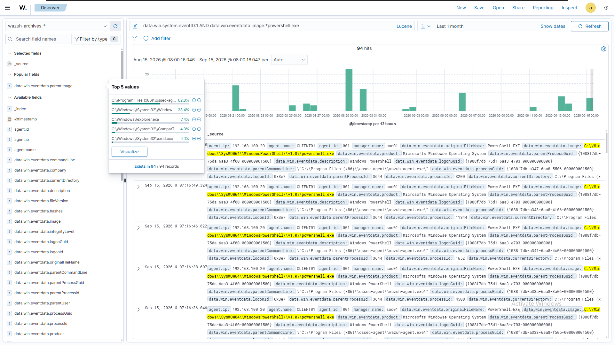
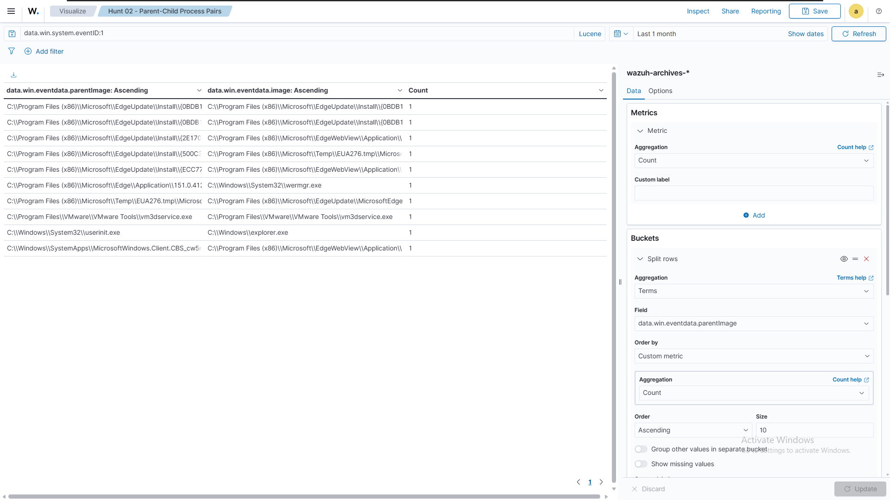
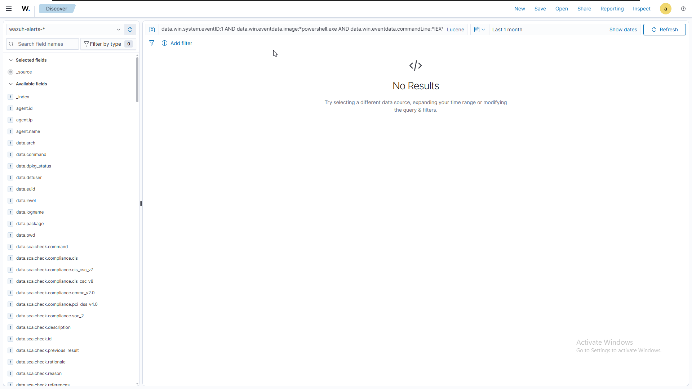
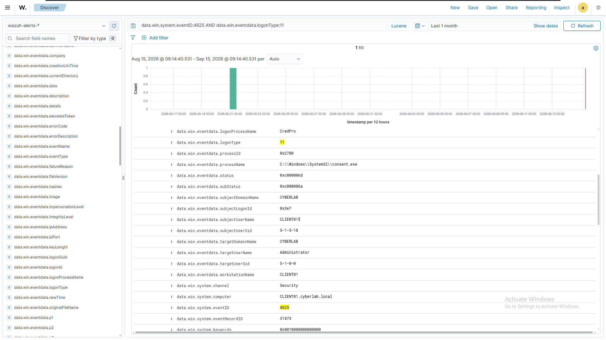

# 09 — Threat Hunting

## 1. Overview

With four Wazuh detections (Phase 07) and their portable Sigma equivalents (Phase 08) established, this phase shifts from *building* detections to *using* the environment's telemetry directly — searching for patterns that existing rules may not cover, rather than waiting for an alert to fire.

Four hunts were conducted against `CLIENT01`'s historical telemetry, each built around an area where existing detection coverage was limited or where additional context could reveal activity not directly surfaced by the current rules: what happens *around* PowerShell execution that rule `100002` doesn't specifically look at, what process relationships exist beyond the one pair rule `100003` covers, what obfuscation techniques exist beyond the single flag rule `100004` covers, and what authentication behavior exists beyond the single logon type rule `100005` covers.

Each hunt follows the same structure: a stated hypothesis, a query against raw telemetry (`wazuh-archives-*`, not just `wazuh-alerts-*`), and an honest finding — including, in one case, a genuine detection gap that was identified but deliberately not remediated in this phase.

---

## 2. What is Threat Hunting?

Threat hunting is the proactive search for malicious or anomalous activity that existing detection rules do not already surface — as distinct from detection engineering (Phase 07), which encodes a *known* behavior into an automated alert, and Sigma translation (Phase 08), which makes that same logic portable.

A hunt starts from a hypothesis about attacker behavior, not from an alert. It typically queries raw telemetry directly, since the behavior being searched for may never have triggered any existing rule. A hunt's outcome is not always "found something bad" — a clean, well-reasoned negative result (confirming a technique has not occurred, or that an anomaly is explainable) is a legitimate and common outcome, and is treated as such in this phase.

Where a hunt does surface something existing detections miss, that finding becomes an input to a future detection-engineering cycle, rather than being resolved ad hoc within the hunt itself.

---

## 3. Threat Hunting Methodology

```text
State a hypothesis
      ↓
Identify a detection gap the hypothesis targets
      ↓
Query raw telemetry (wazuh-archives-*)
      ↓
Establish a baseline (what does "normal" look like?)
      ↓
Investigate anomalies or rare values individually
      ↓
Distinguish "rare and expected" from "rare and anomalous"
      ↓
Record the finding — positive or negative
      ↓
Flag any genuine gap for future detection engineering
```

A recurring principle across all four hunts: **rarity alone does not indicate maliciousness.** Several of the most interesting-looking low-frequency results in this phase turned out to be legitimate once-per-session or once-per-update system events. Distinguishing "rare because it's malicious" from "rare because it only happens once, normally" was the central analytical skill exercised throughout.

---

## 4. Hunting Environment

All hunts were conducted against the same environment established in Phases 05–08:

| Component        | Detail                                                  |
| ---------------- | ------------------------------------------------------- |
| Endpoint         | `CLIENT01` (Windows 11, domain-joined)                  |
| Telemetry source | Sysmon (process creation) and Windows Security auditing |
| Index queried    | `wazuh-archives-*` (raw telemetry)                      |
| Query language   | Lucene                                                  |
| Time range       | Last 30 days, per hunt (adjusted as needed)             |

`wazuh-archives-*` was used in preference to `wazuh-alerts-*` throughout, since hunting is specifically concerned with activity that may not have generated an alert at all — using the alerts index would have silently excluded exactly the data most relevant to this phase.

---

## 5. Hunt 01 — Unusual PowerShell Parent Processes

**Hypothesis:** PowerShell launched by an unexpected parent process may indicate suspicious activity not covered by rule 100002, which alerts on PowerShell execution regardless of parent.

**Query (`wazuh-archives-*`, Lucene):**
```
data.win.system.eventID:1 AND data.win.eventdata.image:*powershell.exe
```


*Full field values listed below, as the Discover sidebar panel truncates long file paths.*

| Parent Process                                              |     % | Assessment                                             |
| ----------------------------------------------------------- | ----: | ------------------------------------------------------ |
| `C:\Program Files (x86)\ossec-agent\wazuh-agent.exe`        | 62.8% | Wazuh agent syscollector/inventory activity — expected |
| `C:\Windows\System32\WindowsPowerShell\v1.0\powershell.exe` | 23.4% | Nested PowerShell sessions from Phase 07/08 testing    |
| `C:\Windows\explorer.exe`                                   |  7.4% | Normal interactive user launches                       |
| `C:\Windows\System32\CompatTelRunner.exe`                   |  4.3% | Windows Compatibility Telemetry — expected OS activity |
| `C:\Windows\System32\cmd.exe`                               |  2.1% | Matches the Detection 03 test pattern                  |

**Finding:** No unexpected or unexplained parent processes were identified. All observed parents correspond to known lab activity or standard Windows/Wazuh background operation.

### Drill-down — explorer.exe-parented launches

Since `explorer.exe` represents genuine interactive human use (as opposed to automated agent activity or scripted test patterns), this slice was examined separately:

**Query:**
```
data.win.system.eventID:1 AND data.win.eventdata.image:*powershell.exe AND data.win.eventdata.parentImage:*explorer.exe
```

Every matching launch used a bare command line — `powershell.exe` invoked with no arguments — consistent with a user opening the console directly rather than running a specific command or script.

**Conclusion:** All observed PowerShell parent processes were explainable within known lab activity or standard Windows/Wazuh background operation. No suspicious or unexplained parent process was identified in this dataset. This does not establish that no gap exists — only that none was observed in the current telemetry — and the baseline should be revisited as additional attack-simulation activity is introduced.

---

## 6. Hunt 02 — Rare Parent-Child Process Relationships

**Hypothesis:** Uncommon or rare parent-child process pairs may reveal activity not captured by rule 100003, which only alerts on one specific pair (`powershell.exe → cmd.exe`).

**Method:** A Data Table visualization was built against `wazuh-archives-*`, filtered to process-creation events (`data.win.system.eventID:1`), with nested terms aggregations on `parentImage` and `image`, sorted both descending (most common pairs) and ascending (rarest pairs).



**Most common pairs** were dominated by core Windows process-management relationships (`services.exe → svchost.exe`, `svchost.exe → taskhostw.exe`, etc.) — expected, high-volume OS internals.

**Rarest pairs (count = 1)** were individually reviewed:

| Parent                       | Child                             | Assessment                                                                                |
| ---------------------------- | --------------------------------- | ----------------------------------------------------------------------------------------- |
| Edge installer components    | Edge/WebView installer components | One-time Edge update/install chain                                                        |
| `userinit.exe`               | `explorer.exe`                    | Standard Windows logon sequence — expected to occur once per session, hence the low count |
| Edge (specific version path) | `wermgr.exe`                      | One-time Edge crash/error reporting activity — expected system behavior                   |
| VMware Tools component       | VMware Tools component            | Self-referential VMware Tools service behavior                                            |
| System App component         | Edge WebView                      | UWP application invoking embedded web rendering                                           |


**Finding:** Low occurrence count does not by itself indicate suspicious activity — several of the rarest pairs observed here (notably `userinit.exe → explorer.exe`) are rare specifically *because* they are legitimate, once-per-session system events, not because they are anomalous. No pair in this sample warranted escalation or a new detection rule. This distinction — rare-and-expected versus rare-and-anomalous — was the primary analytical judgment required for this hunt.

---

## 7. Hunt 03 — Encoded/Obfuscated Command Indicators

**Hypothesis:** Rule 100004 only covers the `-EncodedCommand` flag from a non-PowerShell parent. Several other common PowerShell obfuscation and defense-evasion techniques are not covered by any existing rule. This hunt searched for those indicators across all PowerShell executions, regardless of parent process.

**Method:** Each indicator was searched independently against `wazuh-archives-*`, scoped to PowerShell process-creation events:
```
data.win.system.eventID:1 AND data.win.eventdata.image:*powershell.exe AND data.win.eventdata.commandLine:*<indicator>*
```

| Indicator          | Technique                                                                   | Result  |
| ------------------ | --------------------------------------------------------------------------- | ------- |
| `hidden`           | Hidden window (`-WindowStyle Hidden`)                                       | No hits |
| `IEX`              | Dynamic code execution (`Invoke-Expression`)                                | No hits |
| `DownloadString`   | Download-and-execute pattern                                                | No hits |
| `bypass`           | Execution policy bypass                                                     | No hits |
| `FromBase64String` | In-script Base64 decoding (distinct from the `-EncodedCommand` launch flag) | No hits |



*Representative result; all five indicators returned zero matches under the same query pattern.*

**Finding:** No instances of these five PowerShell obfuscation indicators were found in the available telemetry. This means no observed activity was available to evaluate against detection coverage for these specific techniques. The absence of matches does not establish that detection coverage is complete or that a gap does not exist — it only reflects the activity present in the current dataset, from a lab environment with limited attack simulation.

---

## 8. Hunt 04 — Authentication Failure Patterns

**Hypothesis:** Rule 100005 only covers Logon Type 2 (interactive) failures. Other logon types occurring in the environment may represent an uncovered gap, and a single-event view may miss clustering patterns relevant to brute-force activity.

**Query (`wazuh-archives-*`, Lucene):**
```
data.win.system.eventID:4625
```

**Logon type distribution:**

| Logon Type             |     % | Coverage                         |
| ---------------------- | ----: | -------------------------------- |
| 2 (Interactive)        | 92.3% | Covered by rule `100005`         |
| 11 (CachedInteractive) |  7.7% | **Not covered** by rule `100005` |




**Investigation of the Type 11 event:** the observed Type 11 event was associated with `consent.exe` (the Windows UAC elevation prompt) during a local elevation attempt, where authentication of the `Administrator` account failed with `0xc000006a` (bad password). In this specific case, the event is consistent with a local credential-entry error during UAC elevation rather than remote or network-originated authentication activity.

**Pattern/clustering check:** with only one Type 11 event and no repeated Type 2 failures against the same account in a short window, no evidence of brute-force-style clustering was found in the current dataset.

**Finding:** rule 100005's scope (Logon Type 2 only) is confirmed to be narrower than the full range of failed-logon activity observed in this environment. While this specific Type 11 event is benign (a local UAC elevation mistype), the gap itself is real — Type 11 failures are not currently alerted on. This is flagged as a candidate for a future detection rule, rather than remediated immediately in this phase, consistent with Phase 07's practice of deferring correlation-based and scope-expansion work until a dedicated detection-engineering pass.

---

## 9. Hunt Findings — Summary

| Hunt                                 | Result                                                   | Gap Identified?                  |
| ------------------------------------ | -------------------------------------------------------- | -------------------------------- |
| 01 — Unusual PowerShell parents      | Clean baseline; all observed parents were explainable    | No                               |
| 02 — Rare process pairs              | Clean; rarest pairs were legitimate one-time events      | No                               |
| 03 — Obfuscation indicators          | No instances of the five tested indicators were found    | No observed activity to evaluate |
| 04 — Authentication failure patterns | Logon Type 11 occurred but is uncovered by rule `100005` | **Yes**                          |


Three of four hunts produced clean, well-reasoned negative results. One hunt (04) surfaced a genuine, if currently benign, coverage gap. Both outcomes are treated as valid — the goal of this phase was rigorous investigation, not manufacturing findings.

---

## 10. False Positives & Limitations

* **Lab scale.** All telemetry originates from a single endpoint generating its own test activity. A clean result here does not generalize to a multi-user, multi-endpoint production environment with organic (and noisier) user behavior.
* **Self-generated ground truth.** Because the person conducting the hunt also generated nearly all of the underlying activity (Phases 05–08 testing), every result could be explained by known lab activity or expected system behavior. In a real SOC, hunters typically do not have this luxury and must investigate genuinely unknown activity.
* **Negative results are time-bound.** Hunt 03's "no obfuscation indicators found" reflects the telemetry history available at the time of the hunt, not a permanent guarantee — new activity could introduce these patterns at any point.
* **Type 11 logons are not inherently suspicious.** As found in Hunt 04, this logon type is commonly triggered by routine UAC elevation prompts. Any future detection built on this finding should account for that base rate to avoid high false-positive volume.

---

## 11. MITRE ATT&CK Mapping

| Hunt                         | Related Technique(s)              | Notes                                                                                                                   |
| ---------------------------- | --------------------------------- | ----------------------------------------------------------------------------------------------------------------------- |
| 01 — PowerShell parents      | T1059.001                         | Investigates context surrounding existing PowerShell execution coverage                                                 |
| 02 — Process relationships   | —                                 | General process-chain analysis; no single ATT&CK technique was assigned because the hunt examined relationships broadly |
| 03 — Obfuscation indicators  | T1027, T1140 (Deobfuscate/Decode) | Investigates PowerShell obfuscation and decoding behavior                                                               |
| 04 — Authentication patterns | T1110 (Brute Force)               | Investigates failed authentication activity relevant to brute-force behavior; no brute-force activity was confirmed     |


These mappings describe the *technique space* each hunt investigated, not confirmed detections — consistent with the distinction already drawn in Phase 07 between a technique category and a specific validated finding.

---

## 12. Hunting Coverage

| Existing Rule                       | Hunt Extending Its Scope | Gap Found                         |
| ----------------------------------- | ------------------------ | --------------------------------- |
| `100002` (PowerShell execution)     | Hunt 01                  | No                                |
| `100003` (cmd.exe from PowerShell)  | Hunt 02                  | No                                |
| `100004` (encoded PowerShell)       | Hunt 03                  | No                                |
| `100005` (failed interactive logon) | Hunt 04                  | **Yes — Logon Type 11 uncovered** |

---

## 13. Key Lessons

**Hunting requires raw telemetry, not just alerts.** Every hunt in this phase queried `wazuh-archives-*` specifically because the behavior being investigated might never have triggered an existing rule. Restricting queries to `wazuh-alerts-*` would have structurally excluded the possibility of finding anything new.

**Rarity is not a proxy for maliciousness.** The most consistent lesson across Hunts 01 and 02: several of the rarest observed values were rare precisely because they are legitimate, infrequent, expected events (a single logon-sequence process spawn, a one-time software update). Correctly distinguishing this from genuine anomaly required inspecting *why* something was rare, not just noting that it was.

**A clean result is a valid result.** Three of four hunts found nothing actionable. This was not treated as a failure of the hunt — it is direct evidence that the corresponding detection rule's scope is not currently leaving an exploited gap, which is itself useful information.

**A hunt can produce a finding without producing a fix.** Hunt 04 identified a real gap (Logon Type 11 coverage) but deliberately did not turn it into a new rule within this phase. Separating "found a gap" from "closed the gap" keeps each phase's scope honest and traceable.

---

## 14. Current Status

Four threat hunts have been conducted against `CLIENT01`'s historical telemetry, each targeting a specific area not fully covered by the four existing Wazuh detections. Three hunts confirmed clean baselines with no unexplained activity. One hunt (04) identified a genuine, currently-uncovered detection gap (Logon Type 11 failures), which has been documented but deferred rather than immediately implemented as a new rule.

## 15. Next Step

The Logon Type 11 gap identified in Hunt 04 is a natural candidate for the next detection-engineering cycle, following the same workflow established in Phase 07: check existing coverage, confirm the gap, write and validate a rule against real telemetry.

More broadly, the next phase moves toward structured MITRE ATT&CK mapping across all detections and hunts to date, and toward controlled attack simulation — generating multi-step attacker behavior (rather than single isolated test commands) to exercise detection and hunting capability as a connected chain rather than as individual, isolated tests.

See `10-mitre-attack-mapping.md`.