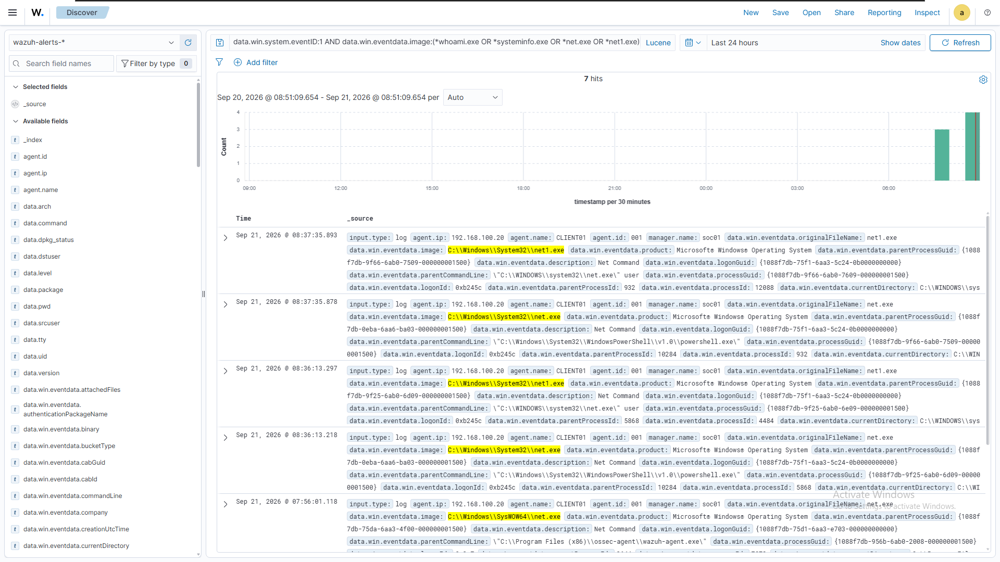
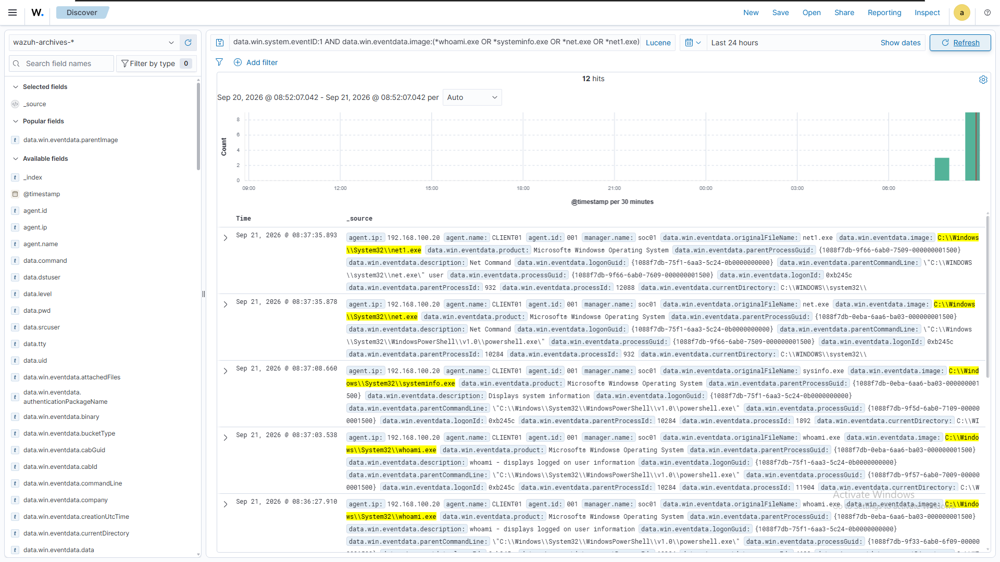
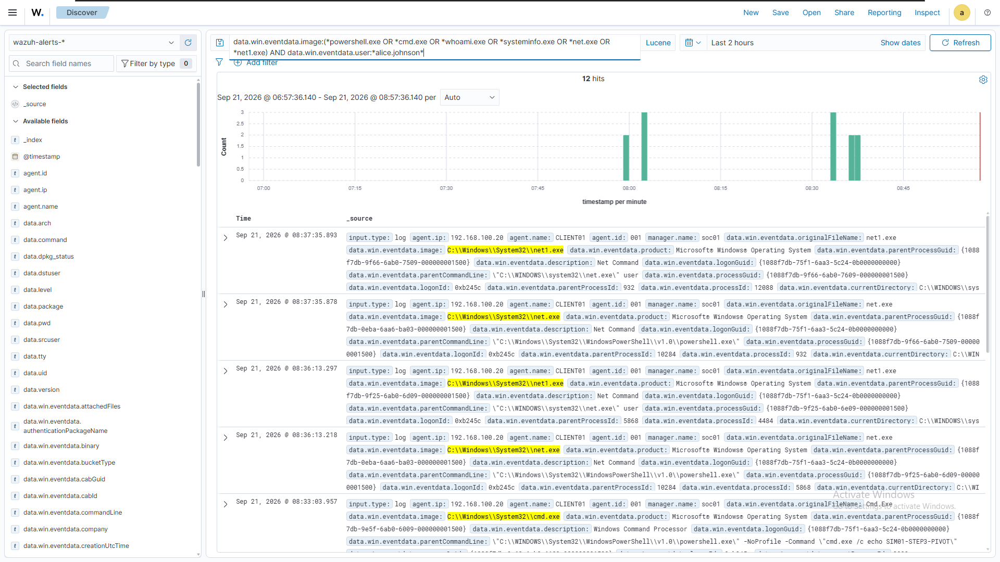
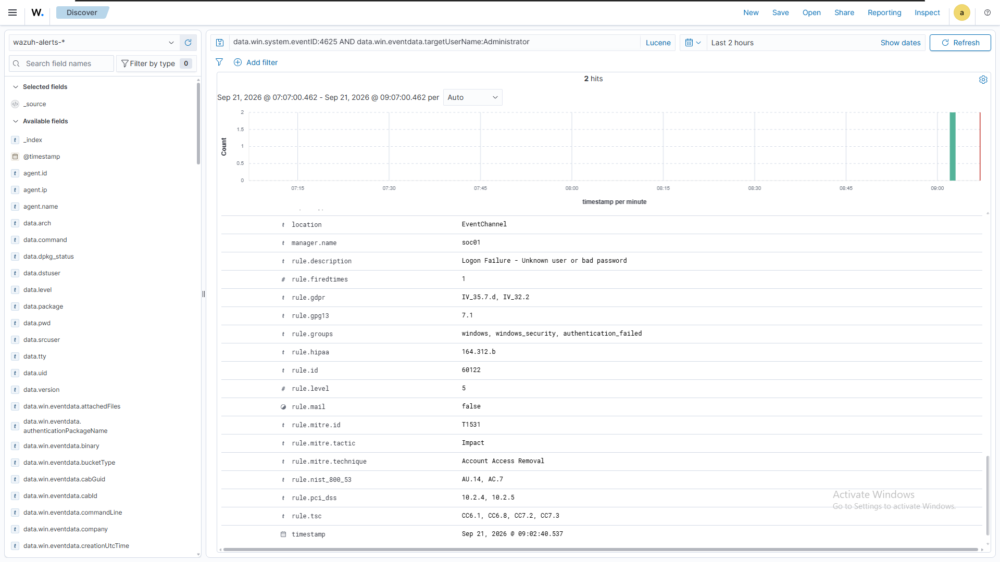
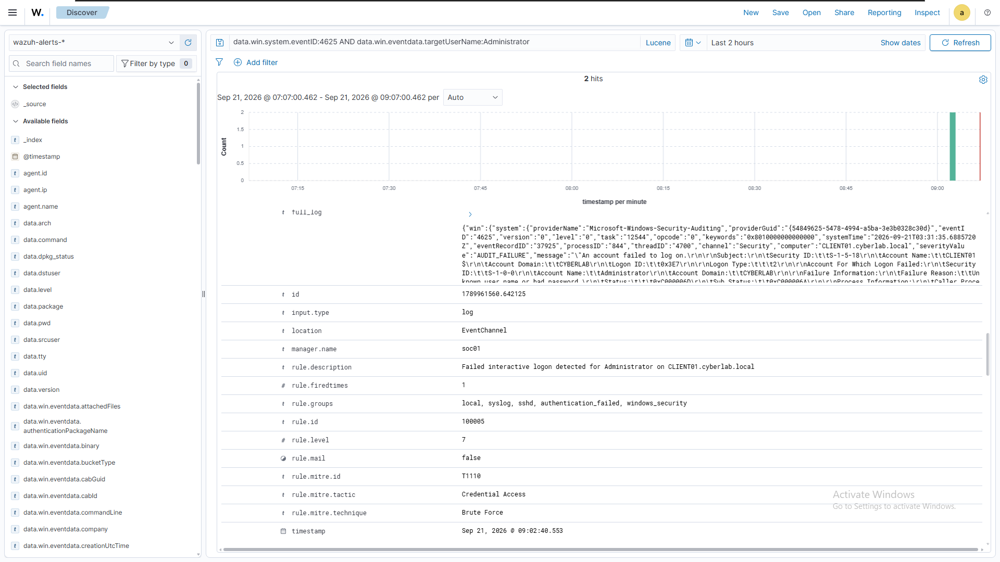

# 11 — Attack Simulations

## Overview

With detections (Phase 07), Sigma translations (Phase 08), threat hunting (Phase 09), and a consolidated ATT&CK coverage matrix (Phase 10) in place, this phase moves from isolated, single-command testing to **controlled, multi-step attack simulation** — chaining several behaviors together in sequence, and using the outcome to test detection coverage, hunting findings, and gaps identified earlier, rather than validating one rule at a time.

Two simulations were conducted, each chosen deliberately rather than repeating earlier single-action tests:

1. **A multi-step attack chain** combining execution, defense evasion, a process pivot, and — new to this phase — discovery activity, none of which had previously been tested as a connected sequence.
2. **A deliberate reproduction of the Logon Type 11 gap** identified in Phase 09, to confirm it was reproducible on demand and to characterize its actual mechanism precisely, rather than relying on a single historical observation.

Both simulations produced findings that were more nuanced than initially predicted, and both corrections are documented explicitly below rather than smoothed over.

---

## 1. Simulation Methodology

```text
Design a scenario using existing detection/hunt coverage as context
       ↓
Execute the behavior on CLIENT01, deliberately and in sequence
       ↓
Confirm telemetry reached SOC01 (wazuh-archives-*)
       ↓
Check which rules fired (wazuh-alerts-*)
       ↓
Compare actual outcome against expected outcome
       ↓
Document the result — including when it differs from what was predicted
```

Consistent with Phases 07–10, no simulation in this phase used Atomic Red Team or any external attack-simulation framework. Every step was a manually constructed, individually understood command — the same approach used throughout this repository. This is noted as a deliberate choice, not an oversight: introducing a new tool at this stage would add setup risk without adding value the existing approach doesn't already provide (see Section 7).

---

## 2. Simulation Environment

Unchanged from Phases 05–10: `CLIENT01` (Windows 11, domain-joined) generating telemetry, `SOC01` running Wazuh, Sysmon and Windows Security auditing as the two telemetry sources. All commands were run as `CYBERLAB\alice.johnson` unless otherwise noted.

---

## 3. Simulation 01 — Multi-Step Attack Chain

### 3.1 Chain Design

```text
Step 1 — Initial execution        (PowerShell)
   ↓
Step 2 — Defense evasion          (encoded command, non-PowerShell parent)
   ↓
Step 3 — Process pivot            (PowerShell → cmd.exe)
   ↓
Step 4 — Discovery                (whoami, systeminfo, net user — new)
```

Steps 1–3 reuse the exact behaviors validated individually in Phase 07 (rules `100002`, `100004`, `100003`), run here as a connected sequence rather than as isolated tests. Step 4 introduces discovery activity, which had not previously been tested against any rule in this lab.

### 3.2 Execution

**Step 1:**
```powershell
powershell.exe -NoProfile -Command "Write-Host 'SIM01-STEP1-EXECUTION'"
```

**Step 2:**
```powershell
$cmd = 'Write-Host "SIM01-STEP2-EVASION"'
$bytes = [System.Text.Encoding]::Unicode.GetBytes($cmd)
$enc = [Convert]::ToBase64String($bytes)
cmd.exe /c powershell.exe -NoProfile -EncodedCommand $enc
```

**Step 3:**
```powershell
powershell.exe -NoProfile -Command "cmd.exe /c echo SIM01-STEP3-PIVOT"
```

**Step 4:**
```powershell
whoami /all
systeminfo
net user
```

### 3.3 Telemetry and Detections Fired

Step 4 comprised three separate discovery commands, each assessed individually below.

| Step | Behavior | Rule | Level | MITRE |
|---|---|---|---|---|
| 1 | PowerShell execution | `100002` | 5 | T1059.001 |
| 2 | Encoded PowerShell, cmd.exe parent | `100004` | 10 | T1059.001, T1027 |
| 3 | cmd.exe spawned by PowerShell | `100003` | 6 | T1059.003 |
| 4a | `net user` | `92031` / `92033` (Wazuh default rules) | 3 | T1087, T1059.001 |
| 4b | `whoami /all` | *(none)* | — | — |
| 4c | `systeminfo` | *(none)* | — | — |

Steps 1–3 fired exactly as expected, confirming the individually validated Phase 07 detections also fire correctly when triggered as part of a connected sequence rather than in isolation.

### 3.4 Step 4 — A Corrected Finding

The initial expectation for Step 4 was that no discovery command would generate any alert, since no custom rule in this lab targets discovery behavior. This was **not entirely correct**, and the actual result is more useful than the prediction:

- **`net user` was caught** — not by a custom rule, but by two of Wazuh's **default** ruleset entries (`92031`, `92033`), which specifically watch for `net.exe`/`net1.exe` discovery activity and its PowerShell-parented variant. This coverage existed before this project began and had not previously been identified.
- **`whoami` and `systeminfo` were not caught.** Both were confirmed present in `wazuh-archives-*` (proving Sysmon captured them) but absent from `wazuh-alerts-*` (confirming no rule, default or custom, alerts on them).


*`net.exe`/`net1.exe` present with default-rule alerts; `whoami.exe` and `systeminfo.exe` absent.*


*The same four processes, all confirmed captured in raw telemetry regardless of alerting outcome.*

**Corrected finding:** discovery-technique coverage in this lab is **partial, not absent**. `net user`-style account discovery is caught by Wazuh's default ruleset; process-level system/user discovery via `whoami` and `systeminfo` is not covered by any rule, default or custom.

### 3.5 Chain Timeline


*`wazuh-alerts-*`, scoped to `alice.johnson`'s activity within the test window, shown in timestamp order — the alerts generated by Steps 1-3 and the `net user` default-rule hit from Step 4, appearing as one connected sequence.*

---

## 4. Simulation 02 — Logon Type 11 Gap Test

### 4.1 Objective

Phase 09 (Hunt 04) identified, from historical telemetry, that Logon Type 11 (CachedInteractive) authentication failures occur in this environment and are not matched by rule `100005` (which filters to Logon Type 2 only). That finding came from a single historical UAC-mistype event. This simulation deliberately reproduces the same behavior on demand, to confirm the gap is real and reproducible rather than a one-off artifact, and to characterize its actual mechanism.

### 4.2 Execution

A UAC elevation prompt was triggered on `CLIENT01` (via "Run as administrator"), and an incorrect password was deliberately entered for the local `Administrator` account.

### 4.3 Result — A Refined Finding

The reproduction revealed a mechanism neither Phase 09 nor the initial hypothesis for this simulation had identified: **a single UAC mistype generates two separate Event ID 4625 entries**, milliseconds apart, from the same `consent.exe` caller process and the same failure status — one with Logon Type 11, one with Logon Type 2:

```text
Event 1 — Logon Type 11 (CachedInteractive) — matched rule 60122 (Wazuh default)
Event 2 — Logon Type 2  (Interactive)        — matched rule 100005 (custom)
```

Both events **did** generate an alert — this corrects the original hypothesis, which expected the Type 11 event to go entirely unalerted. The actual, more precise finding is:

**The Type 11 event is caught only by Wazuh's generic default rule (`60122`, "Logon Failure - Unknown user or bad password") — not by the custom, purpose-built rule (`100005`), whose specific description and scoped MITRE tagging do not extend to this logon type.**


*Rule `60122`, generic description, `logonType: 11`.*


*Rule `100005`, purpose-built description, `logonType: 2` — the same UAC mistype, captured with the intended specificity.*

### 4.4 Decision — Gap Documented, Not Closed

A candidate rule (`100006`, matching `logonType:11` under the same `if_sid:60122` parent as `100005`) could close this gap immediately, using the same pattern already validated for `100005`. This was deliberately **not built in this phase**.

**Reasoning:** Phase 11's purpose is simulation and validation of existing coverage, not new detection engineering — building a new rule here would blur a phase boundary this repository has otherwise kept deliberate throughout Phases 07–10. More practically, an unclosed, precisely-characterized gap is more useful going into Phase 12 (Incident Investigations) than a closed one: investigating *why* one of two near-identical events alerted with full specificity and the other only triggered a generic default rule is a more substantive investigation exercise than one where every event was already correctly and specifically detected.

---

## 5. Detection Performance Summary

| Behavior | Detection | Outcome |
|---|---|---|
| PowerShell execution (chain step 1) | `100002` | Fired as expected |
| Encoded PowerShell, non-PS parent (chain step 2) | `100004` | Fired as expected |
| PowerShell → cmd.exe (chain step 3) | `100003` | Fired as expected |
| `net user` discovery (chain step 4) | `92031` / `92033` (default) | Fired — previously unidentified default coverage |
| `whoami` / `systeminfo` discovery (chain step 4) | — | No coverage, default or custom |
| Logon Type 11 failure (Sim 02) | `60122` (default only) | Generic alert only; not matched by custom rule `100005` |
| Logon Type 2 failure (Sim 02, companion event) | `100005` | Fired with full specificity |

---

## 6. Gaps Confirmed or Closed

| Gap | Status |
|---|---|
| Logon Type 11 lacks a specific custom detection | **Confirmed, reproducible, mechanism characterized.** Deliberately not closed in this phase (see 4.4). |
| `whoami` / `systeminfo` discovery activity is uncovered | **Newly identified** in this phase. Not previously flagged in Phases 07–10. Candidate for future detection engineering. |
| `net user` discovery coverage | **Resolved as a non-gap** — default Wazuh rules already provide coverage, previously unidentified in this repository. |

No new detection rules were written in this phase. All three items above are recorded as inputs to future detection-engineering work rather than acted on immediately.

---

## 7. Key Lessons

**Chaining behaviors validates more than the sum of individual tests.** Steps 1–3 had each been validated individually in Phase 07, but running them as one connected sequence confirmed they behave identically in that context — a fact that was assumed, not previously demonstrated.

**Predictions should be tested, not assumed correct.** Both simulations produced results that corrected an initial hypothesis: Step 4 was expected to show zero discovery coverage, but partial coverage existed via default rules; the Logon Type 11 reproduction was expected to show no alert at all, but revealed a two-event mechanism where a generic alert fires while the specific one does not. Both corrections were identified from the actual evidence before being written into the document, not assumed from the original prediction.

**A generic alert and a purpose-built alert are not equivalent, even when both technically "catch" the same event.** Simulation 02's central finding — that Wazuh's default ruleset partially covers a gap the custom ruleset misses — is a more precise and more useful statement than either "covered" or "uncovered" would have been alone.

**Not every finding needs to be resolved immediately.** The Logon Type 11 gap was deliberately left open rather than closed with a same-phase rule, to preserve it as real material for the next phase's investigation work, and to keep this phase's scope aligned to simulation and validation rather than detection engineering.

**Tooling choices should be justified, not defaulted to.** Atomic Red Team was considered and deliberately not used in this phase — every technique needed was already understood from Phase 07, and introducing a new framework would have added setup overhead without adding technique-syntax knowledge this project didn't already have.

---

## 8. Current Status

Two attack simulations have been conducted against `CLIENT01`. The first chained four behaviors (execution, evasion, pivot, discovery) in sequence and confirmed Phase 07's detections fire correctly in a connected-chain context, while also identifying previously unrecognized default-rule coverage for one discovery technique and confirming a genuine gap for two others. The second deliberately reproduced the Logon Type 11 gap identified in Phase 09, confirmed it is reproducible on demand, and precisely characterized its mechanism — a dual-event UAC failure where only one of the two events receives specific, purpose-built detection.

Three coverage items are now recorded as candidates for future detection engineering: Logon Type 11 specificity, `whoami`/`systeminfo` discovery coverage, and confirmation that `net user` discovery is already handled by default rules.

## 9. Next Step — Incident Investigations

The Logon Type 11 / Type 2 event pair from Simulation 02 provides a concrete, well-understood starting point for the next phase: investigating a real (self-generated) incident from the telemetry alone, reconstructing what happened and why detection behaved the way it did, in the same analytical posture a SOC analyst would use when responding to an actual alert.

See `12-incident-investigations.md`.