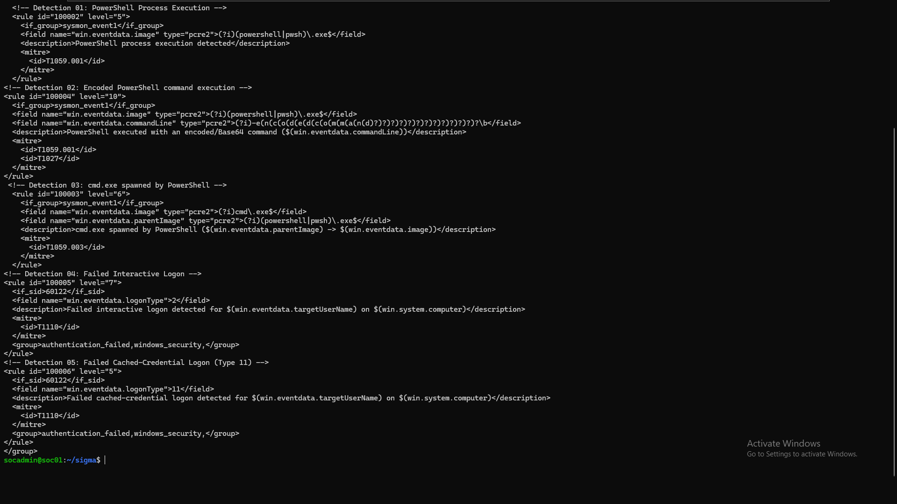
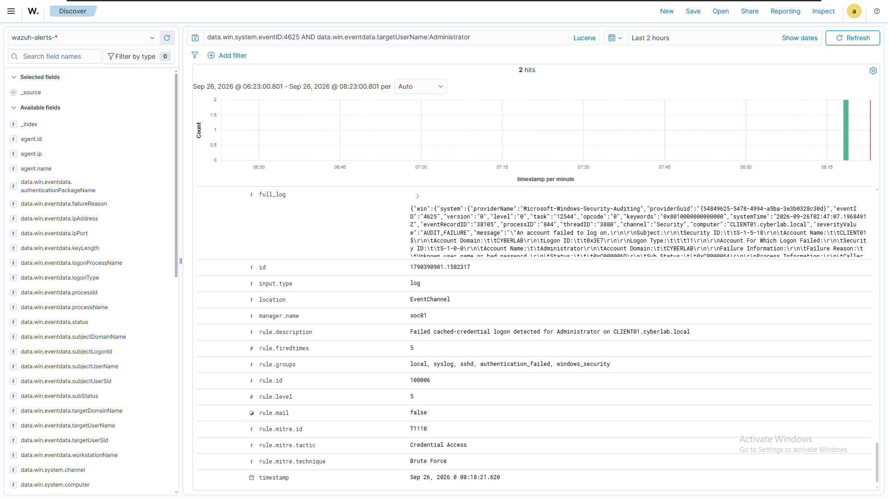
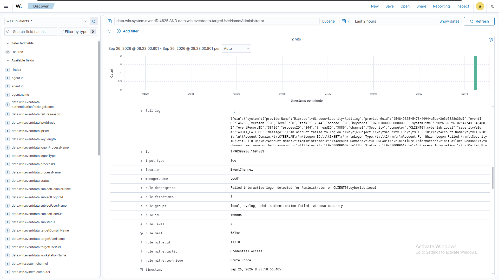

# 13 — Incident Response

## Overview

This phase documents the response actions that would follow the two incidents investigated in `12-incident-investigations.md`, formatted as incident response reports rather than the technical, evidence-dense style used in Phases 07–12. This is a deliberate stylistic shift: this document is written to be readable by a non-technical stakeholder, not just an analyst — Executive Summary first, technical detail available but not required to understand the outcome.

This phase also closes the loop first opened in Phase 09: the Logon Type 11 detection gap, identified by threat hunting, reproduced by simulation, investigated as an incident, is resolved here with a new, validated detection rule. That closure is documented with the same rigor as every other rule in this project — written, syntax-checked, reloaded, and validated against a freshly reproduced event.

---

## 1. Incident Response Methodology

```text
Executive Summary        — what happened, in plain language
       ↓
Containment              — what would stop it from continuing
       ↓
Eradication              — what would remove the underlying cause
       ↓
Recovery                 — what confirms normal operation resumed
       ↓
Recommendations           — what should change to prevent recurrence 
                            or improve detection
```

Both incidents below were classified in `12-incident-investigations.md` as benign, self-generated simulation activity. Containment and eradication sections are therefore written as **what would have been done had this been a genuine incident**, rather than actions actually taken — this is stated explicitly in each report rather than left ambiguous.

---

## 2. Incident Response Report — Incident 01 (Execution Chain)

### 2.1 Executive Summary

A sequence of four related security alerts was generated on `CLIENT01` within a short window, beginning with PowerShell execution and progressing through an encoded command, a process pivot to the command shell, and system/account discovery activity. Investigation determined this was self-generated test activity for this project (Phase 11, Simulation 01), not a genuine compromise. No unauthorized access, data loss, or persistence mechanism was found.

### 2.2 Containment

Had this been genuine attacker activity, appropriate containment steps would include:
- Isolating `CLIENT01` from the network (disabling the network adapter or applying a host-level firewall block) to prevent further command-and-control activity or lateral movement
- Disabling or suspending the `CYBERLAB\alice.johnson` account pending investigation, if the activity was inconsistent with the account owner's expected behavior
- Preserving the current process tree and any related artifacts (temp files, scheduled tasks) before further remediation, to avoid destroying evidence

No containment action was taken in this instance, since the activity was confirmed self-generated and non-malicious before any response was warranted.

### 2.3 Eradication

For genuine activity of this kind, eradication would involve:
- Terminating any surviving processes in the identified chain
- Removing any persistence mechanism established during the chain (none was found here — see Phase 11, Section 3.3, which confirmed no persistence step was included in this simulation)
- Reviewing the decoded payload of any encoded command for indicators requiring broader remediation (the decoded payload here was a benign string output — see `12-incident-investigations.md`, Section 2.2)

No eradication action was required.

### 2.4 Recovery

No recovery action was required, as no system state was altered by the activity. In a genuine incident, recovery would involve confirming the host is returned to a known-good state (via reimage or verified manual remediation) before returning it to production use.

### 2.5 Recommendations

- **Discovery-technique coverage should be extended.** Phase 11 confirmed `whoami` and `systeminfo` generate no alert of any kind, while `net user` is caught only by Wazuh's default ruleset. A future detection-engineering pass should evaluate whether purpose-built rules for these specific discovery commands are warranted, following the same coverage-check-first workflow established in Phase 07.
- **Alert correlation across a time window would improve triage speed.** This incident's four alerts were manually correlated by process lineage during investigation. A correlation rule or dashboard grouping alerts by agent and time window would surface a chain like this as a single incident automatically, rather than as four separate items in an analyst's queue.

---

## 3. Incident Response Report — Incident 02 (Authentication Anomaly)

### 3.1 Executive Summary

Two related authentication-failure alerts were generated on `CLIENT01` within the same second, both traced to a single local UAC elevation attempt against the `Administrator` account with an incorrect password. Investigation determined this was a self-generated reproduction of a gap identified during earlier threat hunting (Phase 09), not a genuine unauthorized access attempt. No remote access, lateral movement, or repeated-attempt pattern was found.

### 3.2 Containment

Had this represented genuine unauthorized activity, appropriate containment would include:
- Confirming whether the attempt originated from an interactively logged-on user with legitimate access to the host (as was the case here) versus an unknown actor
- If unauthorized: locking the `Administrator` account and forcing a password reset
- Reviewing whether any other accounts show similar failure patterns in the same time window, to rule out a broader credential-guessing attempt

No containment action was taken, since the activity was confirmed as a deliberate, authorized reproduction before response was warranted.

### 3.3 Eradication

Not applicable — no unauthorized access was gained, and no artifact requiring removal was created by this activity.

### 3.4 Recovery

Not applicable — no system state was altered.

### 3.5 Recommendations

- **Extend detection coverage to Logon Type 11.** The investigation in `12-incident-investigations.md` established that Logon Type 11 failures receive only generic detection (Wazuh's default rule `60122`), not the specificity of a purpose-built rule. This recommendation is acted on directly in Section 4 below, rather than only recorded for future work.
- **Consider correlation-based brute-force detection.** As already noted in Phases 07 and 09, a single failed logon of any type is a weak standalone signal. A threshold-based correlation rule (multiple failures, same account or source, defined time window) remains a stronger foundation for genuine T1110 (Brute Force) detection than any single-event rule, including the one added below.

---

## 4. Closing the Loop — Rule 100006

### 4.1 Rule Design

```xml
<!-- Detection 05: Failed Cached-Credential Logon (Type 11) -->
<rule id="100006" level="5">
  <if_sid>60122</if_sid>
  <field name="win.eventdata.logonType">11</field>
  <description>Failed cached-credential logon detected for $(win.eventdata.targetUserName) on $(win.system.computer)</description>
  <mitre>
    <id>T1110</id>
  </mitre>
  <group>authentication_failed,windows_security,</group>
</rule>
```

This mirrors rule `100005`'s structure exactly, changing only the matched `logonType` value. The severity is set to **Level 5**, deliberately lower than `100005`'s Level 7 — Phase 09 and Phase 12 both established that Type 11 failures have a known, common benign cause (UAC elevation mistypes), making this a weaker standalone signal than a Type 2 interactive failure. The lower level is a direct, evidenced design decision rather than an arbitrary choice.

**Note on Sigma coverage:** rule `100006` was added after the Sigma translation phase (Phase 08) concluded. A matching Sigma rule is not included in this project's `sigma/` directory. Extending Sigma coverage to this detection is recorded as a candidate for future work rather than retroactively reopening Phase 08's scope.



### 4.2 Validation

The rule was applied, syntax-checked, and the manager reloaded following the same process established in Phase 07:

```bash
sudo /var/ossec/bin/wazuh-analysisd -t
sudo systemctl restart wazuh-manager
```

The Logon Type 11 scenario was reproduced identically to Phase 11, Simulation 02 (a UAC elevation prompt against `Administrator` with an incorrect password). Both resulting events, generated from the same action, now receive purpose-built detection:





**Confirmed:** the gap identified in Phase 09, reproduced and characterized in Phase 11, and investigated in Phase 12, is resolved. Both halves of a UAC elevation failure now generate specific, purpose-built alerts rather than one specific and one generic-only.

---

## 5. Project Retrospective

**What turned out to be the strongest material.** The debugging narratives in Phases 07 and 08 — the backslash/hyphen field-encoding issues, the rule-priority ("highest-level-wins") discovery, the ECS-versus-Wazuh field-naming mismatch — proved more valuable than any individual rule or hunt result on its own. The Logon Type 11 thread running through Phases 09, 11, 12, and 13 is the clearest example of sustained, evidence-based work in the whole project: a finding that was discovered, reproduced, investigated, and finally resolved, each phase adding a genuinely new layer rather than repeating the last.

**What was deliberately kept small.** This project never claims coverage it didn't build and test — five detections, not forty; a six-row ATT&CK matrix, not a full heatmap; two attack simulations, not an exhaustive campaign. Several points across this project (Phase 08's Sigma rule count, Phase 10's coverage matrix, Phase 11's choice not to use Atomic Red Team) were explicit decisions to stay small and evidenced rather than large and asserted.

**What remains explicitly out of scope.** This lab covers a single endpoint (`CLIENT01`) with no correlation-based detections and no multi-host or lateral-movement testing. Several tactics (Persistence, Lateral Movement, Exfiltration, Command and Control) have zero coverage, as recorded plainly in Phase 10. These are not gaps discovered by accident — they are boundaries the project chose not to cross, and are recorded here as legitimate next steps rather than omissions.

---

## 6. Current Status

All thirteen phases of this project are complete. Five custom Wazuh detections exist, four with matching Sigma translations and one (`100006`) added in this final phase to close a gap traced across four separate documents. Four threat hunts, two attack simulations, and two incident investigations were conducted against real, self-generated telemetry, each contributing to a coverage picture that is honestly scoped rather than inflated.

## 7. Project Complete

This concludes the Enterprise SOC Lab project as originally scoped in the repository roadmap. The project demonstrates, with evidence rather than assertion, an end-to-end security operations workflow: infrastructure and telemetry setup, detection engineering, portable detection translation, threat hunting, ATT&CK-based coverage mapping, controlled attack simulation, incident investigation, and incident response — including one detection gap carried through the full cycle from discovery to resolution.